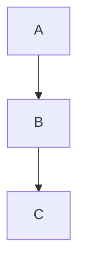

# 文档编写规则

> **适用范围**：`docs/` 目录和所有 Markdown 文档
> **优先级**：强建议 - 强烈建议遵循

---

## 文档真实性原则

### 禁止超前文档
- 禁止：在代码实现前编写功能描述文档
- 禁止：在架构设计前编写详细 API 文档
- 禁止：记录未验证的假设或计划

### 文档必须反映实际状态
- 必须：文档描述的是已实现的功能
- 必须：API 文档与实际代码一致
- 必须：架构图反映当前系统状态

### 验证机制
- 使用 `verification-before-completion` Skill 验证
- 文档 PR 必须包含对应的代码变更
- 定期审计文档与代码的一致性

---

## 研究文档规范

### 必须包含原文引用

在 `docs/research/` 中保存的研究文档**必须**包含：

1. 官方文档 URL
2. 查阅日期
3. 关键配置/API 的**原文摘录**（非截图）
4. 官方示例代码（直接复制）

### 格式示例

```markdown
# Qoder Hooks 配置

**Source**: https://docs.qoder.com/extensions/hooks  
**Accessed**: 2025-05-03  

## 官方配置格式（原文摘录）

配置文件：`.qoder/settings.json`（JSON 格式，非 YAML）

```json
{
  "hooks": {
    "PreToolUse": [
      {
        "matcher": "Bash",
        "hooks": [
          {
            "type": "command",
            "command": "~/.qoder/hooks/block-rm.sh"
          }
        ]
      }
    ]
  }
}
```
```

**禁止行为**：
- 禁止：基于记忆或推测编写配置
- 禁止：使用截图代替原文
- 禁止：不标注信息来源

---

## 文档结构规范

### 设计文档

```markdown
# 设计标题

> **状态**: 草稿/已评审/已实施  
> **日期**: YYYY-MM-DD  
> **作者**: 作者名

## 背景

为什么需要这个设计？解决什么问题？

### 方案对比

- **方案 A**：优势 ...，劣势 ...，适用场景 ...
- **方案 B**：优势 ...，劣势 ...，适用场景 ...

## 最终方案

选择哪个方案？为什么？

## 架构设计



## 实施计划

- [ ] Task 1
- [ ] Task 2

## 参考资源

- [链接 1](url)
- [链接 2](url)
```

### API 文档

```markdown
# API 名称

## 接口定义

```typescript
interface ApiResponse<T> {
  success: boolean;
  data?: T;
  error?: string;
}
```

## 使用示例

```typescript
const result = await api.getData();
```

### 错误处理

- **400**：请求参数错误 — 检查参数格式
- **500**：服务器内部错误 — 重试或联系支持
```

---

## Markdown 格式规范

### 标题层级
- 使用 `#` 到 `###`（最多 3 级）
- 标题后空一行
- 不要在标题前后加空行

### 代码块
- 始终指定语言：```typescript、```bash
- 复杂代码添加注释
- 保持代码可执行（非伪代码）

### 表格
- 表头与内容用 `|---|` 分隔
- 对齐方式保持一致
- 复杂表格考虑使用列表

### 列表
- 使用 `-` 而非 `*`
- 子列表缩进 2 个空格
- 列表项保持一致的语法结构

---

## 文档维护

### 更新频率
- 功能变更后立即更新文档
- 每月审计文档准确性
- 过时的文档标记为 `@deprecated`

### 版本控制
- 文档与代码同步提交
- 重大变更更新文档版本号
- 保留历史版本记录

### 文档审查
- PR 必须包含文档更新（如适用）
- 重要文档需要评审
- 定期清理过期文档

---

## 文档类型指南

### 设计文档（docs/design/）
- 架构设计、技术方案
- 必须包含方案对比
- 记录决策理由

### 指南文档（docs/guides/）
- 使用指南、最佳实践
- 包含完整示例
- 步骤清晰可执行

### API 文档（docs/api/）
- 接口定义、参数说明
- 使用示例、错误处理
- 保持与代码一致

### 研究文档（docs/research/）
- 技术调研、工具对比
- 必须包含原文引用
- 标注信息来源

---

## 写作风格

### 语言
- 技术术语保持英文（API、Skill、Agent）
- 说明文字使用中文
- 代码块保持英文

### 语气
- 客观描述，避免主观判断
- 使用"建议"而非"必须"（除非是规则）
- 提供上下文和理由

### 示例
- 错误："这个方案非常好，强烈推荐"。正确："方案 A 在处理高并发场景时表现更好（P99 延迟降低 40%），建议在 QPS > 1000 时使用"
- 错误："大家都知道..."。正确："根据官方文档（来源 URL），配置格式如下..."

---

> **重要**：文档是项目的知识库，质量直接影响团队协作效率。
