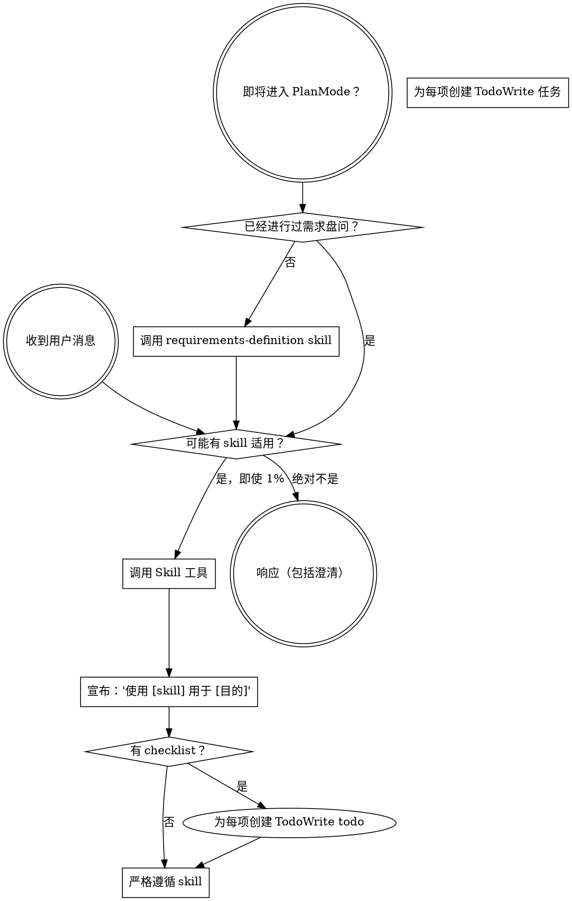

<EXTREMELY-IMPORTANT>
如果你认为某个 Skill 有哪怕 1% 的可能性适用于你当前的工作，你绝对必须调用该 Skill。

如果某个 Skill 适用于你的任务，你没有选择权。你必须使用它。

这不是可以商量的。这不是可选的。你不能找借口绕过它。
</EXTREMELY-IMPORTANT>

## ak47 技能体系概览

ak47 采用**三层混合技能体系**，包含 31 个 Skills（27 个 ak47 Skills + 4 个 OpenSpec Skills）：

### 第一层：ak47 原生 Skills（18 个）

**流程管控**：
- `ak47-skill-entry-guard` - 入口守卫（判定答疑/轻量修改/重量修改）
- `ak47-skill-change-classification` - 变更分类（L1/L2/L3 范式路由）
- `ak47-skill-triage-brief` - 任务简报（生成结构化 Agent 任务说明）

**需求与设计阶段**：
- `ak47-skill-requirements-definition` - 需求定义（创造性工作前必须使用，产出需求宪法文档）
- `ak47-skill-terminology-management` - 术语一致性管理（维护 CONTEXT.md）
- `ak47-skill-architecture-design` - 架构设计（技术方案选型）
- `ak47-skill-harness-design` - 七层架构方法论（指导系统分层设计）
- `ak47-skill-domain-modeling` - 领域建模（DDD 复杂业务领域建模）
- `ak47-skill-vertical-slicing` - 垂直切片（拆分为可独立交付的切片）
- `ak47-skill-improve-architecture` - 架构改进（现有架构的优化与重构）
- `ak47-skill-prototype` - 原型设计（快速原型验证）
- `ak47-skill-zoom-out` - 全局视角（跳出细节看整体架构）

**审查与质量保障**：
- `ak47-skill-critical-review` - 批判性审核（文档存档前独立审查）
- `ak47-skill-code-review` - 代码审查（代码质量评估与改进建议）
- `ak47-skill-anti-patterns` - 反模式检查（设计/实现/流程三类反模式速查表）
- `ak47-skill-doctor-analysis` - 项目健康体检分析（编排 CLI + git diff 综合诊断）

**知识管理**：
- `ak47-skill-experience-summarization` - 经验沉淀（识别、提炼、归档可复用经验）
- `ak47-skill-knowledge-retrieval` - 知识检索（系统化检索 .ak47/experiences/ 知识资产）
- `ak47-skill-knowledge-research` - 知识调研（外部技术调研与信息评估）

### 第二层：OpenSpec Skills（4 个）

- `openspec-propose` - 提案生成（需求批准后调用）
- `openspec-apply-change` - 变更实施
- `openspec-explore` - 探索模式（需求澄清和问题调查）
- `openspec-archive-change` - 变更归档

### 第三层：ak47 改造 + Git 工作流 Skills（9 个）

**代码质量**：
- `ak47-skill-test-driven-development` - TDD（融合 mattpocock 垂直切片理念）
- `ak47-skill-systematic-debugging` - 系统调试（6 阶段调试循环 v0.3.0）

**计划与执行**：
- `ak47-skill-writing-plans` - 编写计划（融入 triage-brief 流程）
- `ak47-skill-executing-plans` - 执行计划（TODO→IN_PROGRESS→DONE）

**Git 工作流**：
- `ak47-skill-using-git-worktrees` - Git Worktree（隔离工作空间）
- `ak47-skill-finishing-a-development-branch` - 完成开发分支

**Skill 编写**：
- `ak47-skill-writing-skills` - 创建/编辑 Skill 文档

## 如何访问 Skill

**在 Qoder 中：** 使用 `Skill` 工具。当你调用 Skill 时，它的内容会被加载并呈现给你 —— 直接遵循即可。切勿对 Skill 文件使用 Read 工具。

**Skill 位置**：`templates/qoder/skills/<skill-name>/SKILL.md`

# 使用 Skill

## 规则

**在任何响应或行动之前，调用相关或被请求的 Skill。** 即使某个 Skill 只有 1% 的可能性适用，你也应该调用它来检查。如果调用的 Skill 最终不适用于当前情况，你不需要使用它。



## 危险信号

这些想法意味着停止——你正在找借口：

| 想法 | 现实 |
|---------|---------|
| "这只是个简单的问题" | 问题就是任务。检查 skills。 |
| "我需要先了解更多上下文" | Skill 检查在澄清问题之前。 |
| "让我先探索一下代码库" | Skills 告诉你如何探索。先检查。 |
| "我可以快速查看 git/文件" | 文件缺乏对话上下文。检查 skills。 |
| "让我先收集信息" | Skills 告诉你如何收集信息。 |
| "这不需要正式的 skill" | 如果 skill 存在，使用它。 |
| "我记得这个 skill" | Skills 会演进。阅读当前版本。 |
| "这不算任务" | 行动 = 任务。检查 skills。 |
| "这个 skill 杀鸡用牛刀" | 简单的事情会变复杂。使用它。 |
| "我先做这一件事" | 在做任何事情之前先检查。 |
| "这感觉很有成效" | 无纪律的行动浪费时间。Skills 防止这种情况。 |
| "我知道那是什么意思" | 知道概念 ≠ 使用 skill。调用它。 |

## Skill 优先级

当多个 skills 可能适用时，使用此顺序：

### 1. 需求与设计阶段（必须最先执行）

**流程 skills** - 这些决定如何着手任务：
- `requirements-definition` - 需求定义（创造性工作前）
- `terminology-management` - 术语管理（与 requirements-definition 配合）
- `critical-review` - 批判性审核（文档批准前）

**示例**：
- "让我们构建 X" → 先 requirements-definition，然后 architecture-design
- "修改这个功能" → 先 requirements-definition，然后 critical-review

### 2. Spec 生成阶段（需求批准后）

**OpenSpec skills** - 这些将需求转化为可执行的 Spec：
- `openspec-propose` - 生成 Spec 提案
- `openspec-explore` - 探索复杂需求

**示例**：
- 需求宪法文档已批准 → 调用 openspec-propose
- 需求模糊需要深入分析 → 调用 openspec-explore

### 3. 实施阶段（Spec 批准后）

**代码质量 skills** - 这些保障代码质量：
- `test-driven-development` - TDD（编写代码前必须）
- `subagent-driven-development` - 子代理开发（多任务并行）
- `using-git-worktrees` - Git 隔离（实施前）

**示例**：
- 开始编码 → 先 TDD，再写实现
- 5 个独立 Task → 使用 subagent-driven-development 并行

### 4. 执行与验证阶段

**计划执行 skills** - 这些指导实施流程：
- `writing-plans` - 编写计划（复杂任务）
- `executing-plans` - 执行计划（有书面计划时）
- `verification-before-completion` - 完成前验证

**示例**：
- 多步骤任务 → 先 writing-plans，再 executing-plans
- 即将声明完成 → 先 verification-before-completion

### 5. 合并阶段

**代码审查 skills** - 这些保障合并质量：
- `requesting-code-review` - 请求审查（合并前）
- `receiving-code-review` - 处理审查反馈
- `finishing-a-development-branch` - 完成分支

**示例**：
- 任务完成 →  requesting-code-review
- 收到反馈 → receiving-code-review
- 审查通过 → finishing-a-development-branch

## Skill 类型

**刚性**（TDD、debugging、requirements-definition）：严格遵循。不要通过适配来规避纪律。

**灵活**（patterns、exploration）：将原则适配到上下文中。

Skill 本身会告诉你属于哪种。

## 完整工作流示例

### 场景 1：新功能开发

```
用户需求："添加用户认证功能"
  ↓
1. requirements-definition（需求定义）
  ↓
2. terminology-management（更新 CONTEXT.md）
  ↓
3. architecture-design（架构设计）
  ↓
4. critical-review（批判性审核）
  ↓
5. openspec-propose（生成 Spec）
  ↓
6. using-git-worktrees（创建隔离分支）
  ↓
7. test-driven-development（TDD 编写测试）
  ↓
8. 实施代码
  ↓
9. verification-before-completion（验证）
  ↓
10. requesting-code-review（请求审查）
  ↓
11. finishing-a-development-branch（完成分支）
```

### 场景 2：Bug 修复

```
用户报告："登录失败，错误 500"
  ↓
1. systematic-debugging（系统调试，追溯根因）
  ↓
2. test-driven-development（先写复现测试）
  ↓
3. 修复代码
  ↓
4. verification-before-completion（验证修复）
  ↓
5. requesting-code-review（请求审查）
```

### 场景 3：重构

```
用户需求："重构订单服务，提升性能"
  ↓
1. requirements-definition（明确重构范围和目标）
  ↓
2. critical-review（审查重构方案）
  ↓
3. openspec-propose（生成重构 Spec）
  ↓
4. test-driven-development（确保测试覆盖）
  ↓
5. subagent-driven-development（并行重构多个模块）
  ↓
6. verification-before-completion（性能验证）
  ↓
7. requesting-code-review（请求审查）
```

## 用户指令

指令说明做什么（WHAT），而不是怎么做（HOW）。"添加 X" 或 "修复 Y" 并不意味着跳过工作流。

**始终遵循**：
1. 检查是否有适用的 Skill
2. 调用 Skill 并严格遵循
3. 完成所有必要步骤后再声明完成
