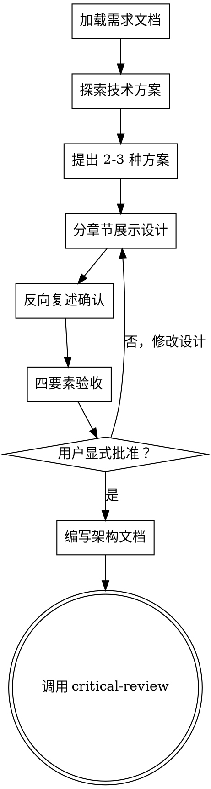

# 架构设计（Architecture Design）

## 用途

在需求文档完成并获得用户批准后，使用此 Skill 进行架构设计。

**触发条件**：
- 需求文档已通过 critical-review 审核
- 用户明确指示进入架构设计阶段
- 需要技术方案选型和架构设计

<HARD-GATE>
在架构设计文档完成并获得用户显式批准之前，禁止编写代码或进入实施阶段。
</HARD-GATE>

---

## 核心流程



---

## 流程详解

### 1. 加载需求文档

**目标**：理解已批准的需求

**操作**：
- 读取 `docs/requirements/YYYY-MM-DD-{topic}-requirements.md`
- 读取 `.qoder/CONTEXT.md` 术语定义
- 确认需求文档已通过 critical-review 审核
- 识别核心需求和约束

---

### 2. 探索技术方案

**目标**：研究可行的技术实现路径

**操作**：
- 分析需求的技术挑战
- 研究可用的技术方案和工具
- 考虑现有系统的技术栈约束
- 评估团队技术能力

---

### 3. 提出 2-3 种方案

**目标**：探索不同实现路径，展示权衡分析

**格式**：

#### 方案 A：{方案名}（推荐）
- **描述**：一句话说明
- **优点**：2-3 个
- **缺点**：1-2 个
- **适用场景**：何时选择这个

#### 方案 B：{方案名}
- **描述**：一句话说明
- **优点**：2-3 个
- **缺点**：1-2 个
- **适用场景**：何时选择这个

#### 方案 C：{方案名}
- （同上）

**推荐说明**：
"我推荐方案 A，因为 {具体理由}。你怎么看？"

---

### 4. 分章节展示设计

**目标**：增量验证，避免一次性展示过大设计

**章节结构**（按需调整）：

#### 章节 1：架构概览
- 高层架构图（文字描述或 ASCII art）
- 核心组件及关系
- 数据流方向

**询问**："这个架构方向对吗？"

#### 章节 2：核心组件
- 每个组件的职责
- 接口定义（**必须遵循深层模块原则**）
  - 接口方法数 ≤ 5 个
  - 深度比 ≥ 10:1
- 依赖关系

**深层模块设计示例**：
```typescript
// ✅ 深层模块：小接口 + 大实现
interface OrderService {
  submitOrder(dto: SubmitOrderRequest): OrderResult;  // 1个接口
  cancelOrder(id: string, reason: string): void;      // 2个接口
  // 内部实现包含 10+ 逻辑，但调用者只需知道这 2 个方法
}
```

**询问**："组件划分合理吗？接口是否够简单？"

#### 章节 3：数据模型
- 核心 Entity/Value Object
- 关系定义
- 关键约束

**询问**："数据模型覆盖所有场景了吗？"

#### 章节 4：错误处理
- 失败场景
- 重试策略
- 降级方案

**询问**："错误处理策略合适吗？"

#### 章节 5：测试策略
- 单元测试覆盖点
- 集成测试场景
- 边界情况测试

**询问**："测试策略充分吗？"

---

### 5. 反向复述确认

**目标**：验证 AI 理解与用户意图一致

**操作**：

AI 必须复述以下内容，用户逐项确认：

```markdown
让我确认一下我的理解：

1. 我们采用的架构模式是：{架构模式}
2. 主要组件包括：{核心组件}
3. 关键技术选型是：{技术选型}
4. 数据流向是：{数据流}
5. 需要关注的风险是：{主要风险}
6. 选择这个方案因为：{选择理由}

我理解得对吗？有遗漏或错误吗？
```

**用户回应**：
- ✅ 完全正确 → 进入四要素验收
- ⚠️ 基本正确，但... → 澄清后继续
- ❌ 有几个地方不对 → 回到设计阶段

---

### 6. 四要素验收

**目标**：确保架构文档满足质量标准

#### 要素 1：架构设计完整性
- [ ] 架构概览（高层图 + 核心组件 + 数据流）✅
- [ ] 核心组件设计（职责 + 接口 + 依赖关系）✅
- [ ] 数据模型（Entity/Value Object + 关系 + 约束）✅
- [ ] 错误处理策略（失败场景 + 重试 + 降级）✅
- [ ] 测试策略（单元测试 + 集成测试 + 边界测试）✅
- [ ] 每个章节都获得用户确认"看起来对"

**量化指标**：
- 设计章节覆盖率 = **必须 100%**（5/5 章节）
- 每章节用户确认数 = **必须 5 次**

#### 要素 2：设计可追溯性
- [ ] 每个架构决策都能追溯到需求文档中的具体条目
- [ ] 无"镀金"功能（通过 YAGNI 检查：无法追溯到需求的设计 = 镀金）
- [ ] 所有需求都至少有一个架构组件支撑（无遗漏需求）

**量化指标**：
- 设计追溯率 = 有需求支撑的设计决策数 / 总设计决策数 = **必须 100%**
- 需求覆盖率 = 有架构支撑的需求数 / 总需求数 = **必须 100%**
- 镀金功能数 = **必须 0**

#### 要素 3：风险已沟通
- [ ] 已识别至少 2 个技术风险（简单需求）或 3-5 个（复杂需求）
- [ ] 每个风险都有：描述、影响程度（高/中/低）、缓解策略
- [ ] 已识别依赖风险（外部系统、第三方库、团队依赖）
- [ ] 用户确认理解所有高风险项

**量化指标**：
- 技术风险识别数 ≥ **2 个**
- 高风险项用户确认数 = **必须 100%**

#### 要素 4：显式批准
- [ ] 用户使用以下明确话术之一批准：
    ✅ "我批准这份架构设计文档"
    ✅ "架构设计确认无误，可以开始编写实施计划"
    ✅ "Approved" / "批准"
  
- [ ] 不接受模糊确认：
    ❌ "好的" / "行" / "可以" / "嗯"
    ❌ 仅点赞表情
    ❌ 沉默（超过 2 分钟无回复）

---

### 7. 编写架构文档

**目标**：将批准的设计持久化

**文件位置**：`docs/plans/YYYY-MM-DD-{topic}-design.md`

**架构文档结构**：
```markdown
# {功能名} 架构设计文档

## 概述
一句话描述

## 需求追溯
- 基于需求文档：`docs/requirements/YYYY-MM-DD-{topic}-requirements.md`
- 需求覆盖情况：

## 方案选择
- 方案 A（推荐）：{理由}
- 方案 B：{为什么不选}
- 方案 C：{为什么不选}

## 架构设计

### 架构概览
{高层架构图 + 核心组件 + 数据流}

### 核心组件
{组件职责 + 接口定义 + 依赖关系}

### 数据模型
{Entity/Value Object + 关系 + 约束}

### 错误处理
{失败场景 + 重试策略 + 降级方案}

### 测试策略
{单元测试 + 集成测试 + 边界测试}

## 架构原则

### 深层模块要求
所有核心模块必须是深层模块，遵循以下规则：
1. **接口方法数** ≤ 5 个
2. **深度比** ≥ 10:1（内部逻辑:接口方法）
3. **调用者友好**：调用者只需了解少量接口
4. **知识集中**：相关逻辑集中在模块内部

**删除测试（Deletion Test）**：
想象删除该模块：
- ❌ 如果复杂度消失 → 只是透传层（浅层，应该删除或合并）
- ✅ 如果复杂度重现到 N 个调用者 → 有价值（深层，保留）

## 技术风险
{已识别的技术风险及缓解策略}

## 术语更新
{如果有新术语，列出并更新 CONTEXT.md}
```

---

### 8. 过渡到批判性审核

**下一步**：调用 `ak47-skill-critical-review` 进行独立审核

**AI 必须遵循**：
1. 架构文档已提交到 git
2. CONTEXT.md 已更新（如果有新术语）
3. 调用 critical-review 进行批判性审核

**禁止**：
- ❌ 直接编写代码
- ❌ 跳过批判性审核
- ❌ 进入实施阶段

---

## 反模式

### 反模式 1：跳过方案对比

**错误**：直接给出一个方案就开始设计

**正确**：必须提出 2-3 种方案并分析权衡

---

### 反模式 2：一次性展示所有设计

**错误**：一次性输出 5000 字的完整架构设计

**正确**：分章节展示，每章获得用户确认后再继续

---

### 反模式 3：镀金设计

**错误**：添加了需求中没有的功能"以防万一"

**正确**：严格遵循 YAGNI 原则，只实现需求明确要求的功能

---

### 反模式 4：不可追溯的设计

**错误**：架构决策无法追溯到具体需求

**正确**：每个设计决策都要说明"这是为了满足需求文档中的哪个需求"

---

## 关键原则

1. **基于需求** —— 所有设计决策都能追溯到需求
2. **方案对比** —— 始终提出 2-3 种方案并分析权衡
3. **增量验证** —— 分章节展示设计，每章获得批准
4. **深层模块** —— 接口简单，实现丰富
5. **反向复述** —— 用自己的话复述理解，确保一致
6. **四要素验收** —— 完整性、可追溯性、风险沟通、显式批准
7. **严格 YAGNI** —— 移除所有镀金功能
8. **批判性审核** —— 架构文档完成后必须经过独立审核

---

## 红线

- ❌ 未加载需求文档就开始设计
- ❌ 跳过方案对比
- ❌ 一次性展示所有设计
- ❌ 添加镀金功能
- ❌ 设计不可追溯
- ❌ 未获得显式批准就进入下一阶段
- ❌ 跳过批判性审核
- ❌ 四要素验收未通过就批准

---

## 与其他 Skill 的关系

| Skill | 关系 | 说明 |
|-------|------|------|
| **requirements-definition** | 前置依赖 | 必须先完成需求定义并获得批准 |
| **critical-review** | 后续调用 | 架构文档批准后的唯一允许步骤 |
| **domain-modeling** | 可选调用 | 如果需要 DDD 建模，在设计中调用 |
| **harness-design** | 可选调用 | 如果需要七层架构评审，在设计中调用 |
| **writing-plans** | 后续调用 | critical-review 通过后进入 |

---

**最终状态是调用 critical-review。** 在架构文档完成并获得用户显式批准之前，禁止进入实施阶段。
