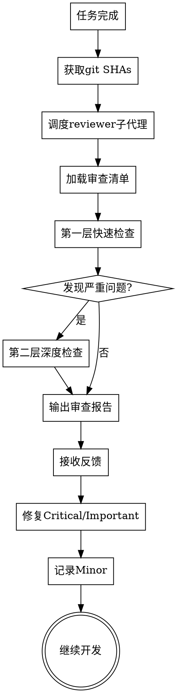

# 代码审查（Code Review）

调度 ak47-agent-reviewer 子代理执行代码审查，在问题扩散之前捕获它们。

**核心原则：** 及早审查，经常审查。独立上下文，客观审查。

---

## 何时请求审查

**强制：**
- 在 subagent-driven development 的每个任务完成后
- 完成主要功能后
- 合并到 main 分支之前

**可选但有价值：**
- 卡住时（新鲜视角）
- 重构之前（基线检查）
- 修复复杂 bug 后

---

## 审查流程



---

## 如何请求

### 1. 获取 git SHAs

```bash
BASE_SHA=$(git rev-parse HEAD~1)  # 或 origin/main
HEAD_SHA=$(git rev-parse HEAD)
```

### 2. 调度 ak47-agent-reviewer 子代理

使用 Task 工具，选择 ak47-agent-reviewer Agent，提供以下信息：

**必填参数：**
- `{WHAT_WAS_IMPLEMENTED}` —— 你刚刚实现了什么
- `{PLAN_OR_REQUIREMENTS}` —— 它应该做什么（需求/计划引用）
- `{BASE_SHA}` —— 起始 commit
- `{HEAD_SHA}` —— 结束 commit
- `{DESCRIPTION}` —— 简要说明

### 3. Agent 执行审查

ak47-agent-reviewer 会：
1. 加载 `code-review-checklist.md` 审查清单
2. 执行第一层快速检查（P0/P1/P2）
3. 如发现严重问题，触发第二层深度检查
4. 输出审查报告到 `.ak47/reviews/review-feedback.md`

### 4. 根据反馈行动

**Critical 级别（必须修复）：**
- 立即修复
- 重新运行测试
- 重新审查

**Important 级别（应该修复）：**
- 在继续之前修复
- 如果有特殊原因不修复，记录理由

**Minor 级别（建议修复）：**
- 记录到技术债清单
- 后续迭代处理

**如果审查者有误：**
- 用技术推理反驳
- 提供证明它工作的代码/测试
- 请求澄清

---

## 示例

```
[刚刚完成任务 2：添加验证函数]

你：让我在继续之前请求代码审查。

BASE_SHA=$(git log --oneline | grep "Task 1" | head -1 | awk '{print $1}')
HEAD_SHA=$(git rev-parse HEAD)

[调度 ak47-agent-reviewer 子代理]
  WHAT_WAS_IMPLEMENTED: 对话索引的验证和修复函数
  PLAN_OR_REQUIREMENTS: 来自 docs/plans/deployment-plan.md 的任务 2
  BASE_SHA: a7981ec
  HEAD_SHA: 3df7661
  DESCRIPTION: 添加了 verifyIndex() 和 repairIndex()，包含 4 种问题类型

[子代理返回审查报告]：
  优点：
    - 架构清晰，职责分离良好
    - 测试覆盖全面（18个测试用例）
    - 错误处理完善
  
  问题：
    Important: 缺少进度指示器
      - 文件: indexer.ts:130
      - 影响: 用户不知道操作进度
      - 建议: 添加 "X of Y" 计数器
    
    Minor: 魔法数字 (100)
      - 文件: indexer.ts:85
      - 建议: 提取为命名常量
  
  评估：修复 Important 后可继续

你：[添加进度指示器]
[重新运行测试，全部通过]
[继续任务 3]
```

---

## 与工作流集成

### Subagent-Driven Development
- 在每个任务完成后审查
- 在问题积累之前捕获
- 在移动到下一个任务之前修复

### Executing Plans
- 在每个批次（3 个任务）完成后审查
- 获取反馈，应用修复，继续执行

### L1 轻量级变更
- 代码完成后自动触发审查
- 快速检查，5-10 分钟完成

### L2/L3 中大型变更
- 第一层快速检查
- 根据发现的问题触发第二层深度检查
- 完整的审查报告和反馈循环

---

## 接收审查反馈的原则

**技术验证，而非情感表演：**

```
收到审查反馈后：

1. 阅读：完整阅读反馈而不做出反应
2. 理解：用自己的话重述要求（或询问）
3. 验证：对照代码库实际情况检查
4. 评估：对本代码库技术上合理吗？
5. 响应：技术确认或有理有据的反驳
6. 实施：一次一项，每项都测试
```

### 禁止的响应

**永远不要：**
- ❌ "你完全正确！"（表演性同意）
- ❌ "好观点！"/"优秀的反馈！"（情感表演）
- ❌ "让我现在实施"（在验证之前）

**而是：**
- ✅ 重述技术要求
- ✅ 提出澄清问题
- ✅ 如果错了，用技术推理反驳
- ✅ 直接开始工作（行动 > 言语）

### 何时应该反驳

在以下情况下反驳：
- 建议会破坏现有功能
- 审查者缺乏完整上下文
- 违反 YAGNI 原则（不需要的功能）
- 对当前技术栈技术上不正确
- 存在历史遗留/兼容性原因

**如何反驳：**
- 基于技术理由，而非防御心理
- 提出具体问题
- 引用可工作的测试/代码
- 如果是架构问题，让用户参与

---

## 危险信号

**永远不要：**
- ❌ 因为"很简单"而跳过审查
- ❌ 忽略 Critical 级别问题
- ❌ 在未修复 Important 级别问题时继续
- ❌ 与有效的技术反馈争论

**如果审查者错了：**
- 用技术推理反驳
- 展示证明它工作的代码/测试
- 请求澄清

---

## 与其他 Skill 的关系

| Skill | 关系 | 说明 |
|-------|------|------|
| **superpowers-test-driven-development** | 前置 | TDD 确保测试覆盖，为审查提供安全网 |
| **superpowers-subagent-driven-development** | 集成 | 每个任务完成后触发代码审查 |
| **superpowers-executing-plans** | 集成 | 每个批次完成后触发代码审查 |
| **ak47-skill-critical-review** | 并列 | 文档审查使用 critical-review，代码审查使用 code-review |
| **superpowers-systematic-debugging** | 后续 | 审查发现的问题可能需要系统性调试 |
| **superpowers-verification-before-completion** | 后续 | 修复审查问题后验证 |

---

## 审查清单参考

详细审查清单请查看：[code-review-checklist.md](code-review-checklist.md)

**两层检查机制：**
- **第一层（必做）**：快速检查清单，5-10 分钟完成
- **第二层（按需）**：深度检查清单，发现严重问题时触发

---

**最终状态**：审查通过或问题已修复 → 继续开发或合并
