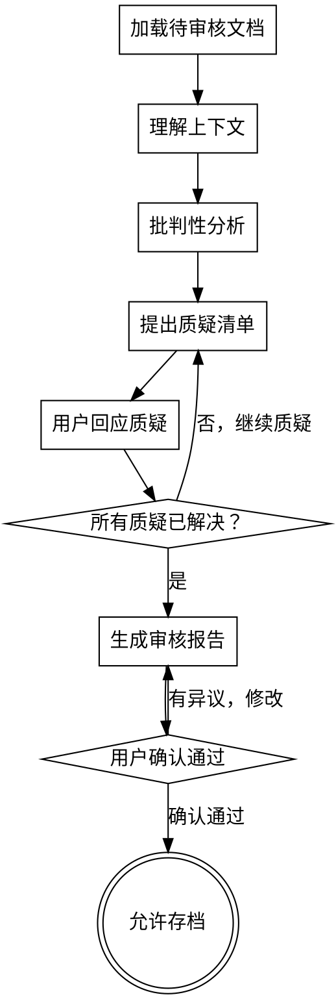

# 批判性审核（Critical Review）

## 用途

在需求文档或架构设计完成后、存档之前，使用此 Skill 进行独立批判性审核。

**触发条件**：
- 需求文档已完成，requirements-definition 调用此 Skill
- 架构设计已完成，architecture-design 调用此 Skill
- 用户主动要求进行批判性审核

**核心原则**：审查者不是作者，必须保持独立批判性思维

<HARD-GATE>
在批判性审核完成并获得用户确认之前，禁止存档文档或进入下一阶段。
</HARD-GATE>

---

## 审核流程



---

## Pre-check：Brief 生成状态检查（审核前必须执行）

**目标**：确保复杂变更在进入批判性审核前已完成 Agent Brief 生成。

**触发时机**：每次 critical-review 启动时（在加载待审核文档之前）。

### 检查流程

1. **评估变更规模**：
   - 读取 `tasks.md`，统计任务组/模块/文件数量
   - 检查是否涉及接口变更（新 API、函数签名修改）

2. **判断是否需要 Brief**：
   - 工作量 > 2 小时
   - 跨模块（≥ 2 个模块）
   - 文件数 > 3
   - 涉及接口变更
   - 符合任一条件 → 需要 Brief

3. **检查 Brief 状态**：
   - 检查 `.ak47/briefs/<change-name>.md` 是否已生成

4. **处理逻辑**：
   ```
   需要 Brief？
     ├─ 是，且已生成 → 继续审核流程
     ├─ 是，但未生成 → 🔴 中断审核
     │   → 提示："当前变更规模符合 Brief 生成条件，但 Brief 尚未生成。
     │            请先调用 ak47-skill-triage-brief 生成 Agent Brief，
     │            再重新启动批判性审核。是否现在生成？"
     │   → 等待用户决定
     └─ 否（简单变更）→ 记录理由，继续审核流程
   ```

5. **偏离记录**：
   - 若用户确认跳过 Brief，必须记录到 `.ak47/deviations.log`：
     ```yaml
     - timestamp: "YYYY-MM-DDTHH:MM:SSZ"
       deviation: "跳过 G6.5 Brief 生成检查"
       reason: "用户确认跳过，理由: {理由}"
       approved_by: "user"
     ```

**禁止行为**：
- ❌ 不检查 Brief 状态就直接进入审核
- ❌ 发现 Brief 缺失但不提示用户
- ❌ 静默跳过偏离记录

---

## 批判性分析维度

### 1️⃣ 假设识别（Assumption Detection）

**目标**：找出文档中隐含的、未明确声明的假设

**检查项**：
- [ ] 是否假设了某些外部系统可用？
- [ ] 是否假设了用户行为模式？
- [ ] 是否假设了技术限制？
- [ ] 是否假设了业务规则不会变化？
- [ ] 是否假设了团队能力/资源？

**质疑话术**：
```
"你在第 X 节提到 {内容}，这是否假设了 {假设}？
如果是，这个假设成立的条件是什么？
如果假设不成立会怎样？"
```

---

### 2️⃣ 边界情况挑战（Edge Case Challenge）

**目标**：发现未考虑的边界情况和异常场景

**检查项**：
- [ ] 极端数据量场景（0、1、极大值）
- [ ] 并发/竞争条件
- [ ] 网络故障/超时
- [ ] 权限/安全边界
- [ ] 数据一致性/事务边界
- [ ] 时间相关场景（时区、夏令时、闰年）

**质疑话术**：
```
"如果 {边界情况} 发生，当前设计会怎样？
我看到文档中没有提到这个场景的处理策略。"
```

---

### 3️⃣ 替代方案质疑（Alternative Challenge）

**目标**：挑战方案选择的合理性，确保没有遗漏更好的方案

**检查项**：
- [ ] 是否真的对比了足够多的方案？
- [ ] 推荐方案的理由是否充分？
- [ ] 是否有行业最佳实践未被考虑？
- [ ] 是否有新技术/新工具可以解决？

**质疑话术**：
```
"你选择了方案 A，但我注意到 {替代方案} 在 {场景} 下可能更合适。
为什么没有考虑这个方案？"
```

---

### 4️⃣ 可维护性质疑（Maintainability Challenge）

**目标**：评估长期维护成本和演化能力

**检查项**：
- [ ] 6 个月后新人能否理解这个设计？
- [ ] 如果需要增加 {功能}，需要改多少地方？
- [ ] 是否有过度设计（违反 YAGNI）？
- [ ] 是否有设计不足（未来必定要重构）？
- [ ] 文档是否充分？

**质疑话术**：
```
"这个设计在 6 个月后需要修改时，维护成本如何？
我看到 {部分} 可能会让未来的人困惑，因为 {原因}。"
```

---

### 5️⃣ 风险评估挑战（Risk Assessment Challenge）

**目标**：确保风险识别充分且有缓解策略

**检查项**：
- [ ] 技术风险是否低估？
- [ ] 依赖风险（第三方库、外部 API、团队）
- [ ] 安全风险（数据泄露、注入、权限）
- [ ] 性能风险（瓶颈、扩展性）
- [ ] 业务风险（需求变化、市场变化）

**质疑话术**：
```
"你列出了 {N} 个风险，但我认为 {风险} 可能被低估了。
如果这个风险发生，影响是什么？缓解策略是什么？"
```

---

### 6️⃣ 一致性检查（Consistency Check）

**目标**：发现文档内部或与外部文档的矛盾

**检查项**：
- [ ] 术语使用是否与 CONTEXT.md 一致？
- [ ] 需求文档与架构设计是否一致？
- [ ] 前后章节是否有矛盾？
- [ ] 数字/指标是否自洽？

**质疑话术**：
```
"你在第 X 节说 {内容 A}，但在第 Y 节说 {内容 B}。
这两者似乎矛盾，请澄清。"
```

---

## 质疑清单格式

### 高优先级（必须解决）

| # | 维度 | 质疑 | 位置 | 严重程度 |
|---|------|------|------|----------|
| 1 | 假设识别 | 假设了外部支付系统可用性 | 架构设计 3.2 | 🔴 高 |
| 2 | 边界情况 | 未处理并发订单冲突 | 架构设计 4.1 | 🔴 高 |
| 3 | 风险评估 | 低估了第三方 API 限流风险 | 架构设计 6.3 | 🔴 高 |

### 中优先级（建议解决）

| # | 维度 | 质疑 | 位置 | 严重程度 |
|---|------|------|------|----------|
| 4 | 可维护性 | OrderService 接口方法过多（8个） | 架构设计 3.1 | 🟡 中 |
| 5 | 替代方案 | 未考虑使用 Event Sourcing | 架构设计 2.3 | 🟡 中 |

### 低优先级（可选）

| # | 维度 | 质疑 | 位置 | 严重程度 |
|---|------|------|------|----------|
| 6 | 一致性 | "用户"和"Customer"混用 | 需求文档 2.1 | 🟢 低 |

---

## 用户回应流程

### AI 提出质疑后：

```markdown
**AI**: 
"我发现了以下质疑：

🔴 高优先级 1：假设了外部支付系统可用性
- 位置：架构设计 3.2
- 问题：设计中假设支付系统 99.9% 可用，如果支付系统宕机怎么办？
- 建议：增加降级策略（如本地队列 + 异步重试）

请回应这个质疑：
A. 接受建议，修改文档
B. 拒绝建议，理由是 {具体原因}
C. 部分接受，修改为 {方案}
D. 需要进一步讨论"
```

### 用户回应后：

```markdown
**如果用户选择 A/C**：
- AI 更新文档
- 标记质疑为"已解决"

**如果用户选择 B**：
- AI 记录拒绝理由
- 标记质疑为"用户确认接受风险"
- 继续下一个质疑

**如果用户选择 D**：
- 回到批判性分析阶段
- 深入讨论后重新评估
```

---

## 审核通过标准

### 必须满足以下条件之一：

**条件 1：所有质疑已解决**
```
- 高优先级质疑解决率 = 100%
- 中优先级质疑解决率 ≥ 80%
- 低优先级质疑解决率 ≥ 50%
```

**条件 2：用户确认接受剩余风险**
```
- 用户明确声明："我理解剩余质疑，确认可以通过"
- 所有未解决的质疑已记录在审核报告中
- 用户理解每个未解决质疑的风险
```

---

## 审核报告格式

```markdown
# 批判性审核报告

## 基本信息
- 审核文档：{文档路径}
- 审核日期：{YYYY-MM-DD}
- 审核类型：[ ] 需求审核 [ ] 架构审核

## 审核统计
- 总质疑数：{N}
- 高优先级：{N}（已解决 {N}，接受风险 {N}）
- 中优先级：{N}（已解决 {N}，接受风险 {N}）
- 低优先级：{N}（已解决 {N}，接受风险 {N}）

## 解决率
- 高优先级解决率：{X}%
- 中优先级解决率：{X}%
- 低优先级解决率：{X}%
- 总体解决率：{X}%

## 剩余风险清单

| # | 质疑 | 用户决定 | 风险等级 |
|---|------|----------|----------|
| 1 | {质疑内容} | 接受风险，理由是 {X} | 🔴 高 |

## 审核结论

[ ] ✅ 通过，可以存档
[ ] ⚠️ 有条件通过，剩余风险已记录
[ ] ❌ 不通过，需要重大修改

## 审核员声明

"我以独立审查者视角完成了批判性审核，所有质疑已充分讨论。
用户已理解剩余风险并做出明确决定。"

审核员：AI Critical Reviewer
日期：{YYYY-MM-DD}
```

---

## 红线

- ❌ 审查者不是文档作者（必须保持独立性）
- ❌ 跳过批判性审核直接存档
- ❌ 高优先级质疑未解决且用户未确认接受风险
- ❌ 审核报告未记录剩余风险
- ❌ 用户未明确确认"可以通过"

---

## 与其他 Skill 的关系

| Skill | 关系 | 说明 |
|-------|------|------|
| **requirements-definition** | 前置调用 | 需求文档完成后调用此 Skill |
| **architecture-design** | 前置调用 | 架构设计完成后调用此 Skill |
| **triage-brief** | 前置依赖 | 复杂变更必须先通过 triage-brief 生成 Brief，再进入 critical-review |
| **terminology-management** | 依赖 | 使用 CONTEXT.md 进行一致性检查 |
| **experience-summarization** | 后续调用 | 审核完成后沉淀经验 |

---

**最终状态**：生成审核报告并获得用户确认 → 允许存档文档
