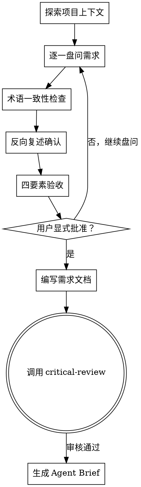

# 需求定义与澄清（Requirements Definition）

## 用途

在创建功能、构建组件、添加功能或修改行为之前，使用此 Skill 进行深度需求盘问。

**触发条件**：
- 用户提出新功能/修改需求
- 检测到需求描述模糊或不完整
- 发现术语使用不一致

<HARD-GATE>
在需求文档完成并获得用户显式批准之前，禁止进入架构设计阶段或编写代码。
</HARD-GATE>

---

## 核心流程



---

## 流程详解

### 1. 探索项目上下文

**目标**：理解当前项目状态

**操作**：
- 检查项目文件结构
- 阅读 README、CONTEXT.md（如果存在）
- 查看最近的 commits
- 识别现有架构模式

---

### 2. 逐一盘问需求

**核心原则**：一次一个问题，等待反馈后再继续

**盘问清单**（按需选择，不是一次全问）：

#### 2.1 目的与价值（What & Why）
- "这个功能解决什么问题？"
- "谁会使用这个功能？"
- "成功标准是什么？"

#### 2.2 约束与边界
- "有哪些技术约束？"
- "必须与哪些现有系统集成？"
- "性能/安全/合规要求是什么？"

#### 2.3 边界情况（强化版）

**核心原则**：发明极端场景，逼迫用户精确定义边界

**场景设计技巧**：

1. **并发冲突**
   - “如果两个用户同时取消同一订单会怎样？”
   - “如果审批流程中两个审批人同时操作会怎样？”

2. **数据极端**
   - “如果有 100 万个订单项，你的设计还能工作吗？”
   - “如果一次请求包含 1000 个数据点会怎样？”

3. **时间边界**
   - “订单在午夜 12:00:00 取消，算当天还是第二天？”
   - “跨时区操作如何处理？”

4. **状态冲突**
   - “订单同时被标记为‘已发货’和‘已取消’，系统如何处理？”
   - “如果审批流程中有人同意、有人拒绝，最终状态是什么？”

5. **权限边界**
   - “客服能取消订单，但能取消已发货的订单吗？”
   - “普通用户能看到管理员的操作日志吗？”

6. **网络异常**
   - “如果支付回调延迟 10 秒会怎样？”
   - “如果数据库连接超时，数据会丢失吗？”

7. **数据不一致**
   - “如果缓存和数据库不一致，以哪个为准？”
   - “如果消息队列重复消费，会创建重复订单吗？”

**要求**：
- 每个核心概念至少发明 2 个极端场景
- 场景必须具体，不能使用“如果出错会怎样”这种模糊描述
- 逼迫用户给出精确的处理策略，不能回答“到时候再看”

#### 2.4 术语澄清
- "你说 'account' — 是指 Customer（客户）还是 User（用户）？"
- "'订单取消' 是指整个 Order 还是部分 OrderItem？"
- "这个 '审批' 和你之前说的 '审核' 是同一个概念吗？"

#### 2.5 代码交叉验证（关键）

**核心原则**：不要相信用户的描述，验证代码

**触发时机**：
- 用户描述现有功能行为时
- 用户描述技术约束时
- 用户描述集成接口时
- 用户描述系统架构时

**操作**：
```
当用户说 X 时：
  1. 使用 read_file 读取相关代码
  2. 使用 grep_code 搜索关键实现
  3. 验证代码是否与用户描述一致
  4. 发现矛盾立即指出
```

**示例**：
- 用户说："订单可以部分取消" 
  → 检查代码：`grep_code("cancel.*order", type="ts")`
  → 发现：代码只支持整单取消
  → 指出："你说可以部分取消，但代码显示 Order.cancel() 会取消整个订单 —— 哪个是正确的？"

- 用户说："审批流程有 3 级"
  → 检查代码：`read_file("src/workflow/approval.ts")`
  → 发现：实际只有 2 级
  → 指出："你说 3 级审批，但代码中 ApprovalWorkflow 只定义了 2 级 —— 需要扩展到 3 级吗？"

- 用户说："我们使用 Redis 缓存"
  → 检查代码：`grep_code("redis|Redis", type="ts")`
  → 发现：没有 Redis 依赖
  → 指出："你说用 Redis，但 package.json 中没有 Redis 依赖 —— 是计划添加还是记错了？"

**红线**：
- ❌ 不要相信用户的口头描述
- ❌ 不要跳过代码验证
- ✅ 必须用代码事实说话

---

### 3. 术语一致性检查

**目标**：确保使用 CONTEXT.md 的统一领域语言

**懒惰创建原则**（关键）：
- ✅ 只在第一个术语被解析时创建 CONTEXT.md
- ❌ 不要在盘问开始前创建空文档
- ❌ 不要在术语未澄清时创建 CONTEXT.md

**操作**：

#### 3.1 检查 CONTEXT.md
```
如果 .qoder/CONTEXT.md 存在：
  1. 读取所有已定义术语
  2. 扫描用户描述中使用的术语
  3. 发现冲突立即指出

如果 .qoder/CONTEXT.md 不存在：
  1. 读取系统模板：ak47/templates/CONTEXT.md
  2. 使用模板格式创建 .qoder/CONTEXT.md
  3. 写入首个已解析的术语
```

#### 3.2 新术语处理
```
如果发现新术语：
  1. 询问用户定义
  2. 确认中文翻译
  3. 列出应避免的别名
  4. 立即更新 CONTEXT.md
```

---

### 4. 反向复述确认

**目标**：验证 AI 理解与用户意图一致

**操作**：

AI 必须复述以下内容，用户逐项确认：

```markdown
让我确认一下我的理解：

1. 你要解决的核心问题是：{问题}
2. 目标用户是：{用户}
3. 成功标准是：{可验证的标准}
4. 关键约束是：{约束}
5. 主要边界情况是：{边界情况}

我理解得对吗？有遗漏或错误吗？
```

**用户回应**：
- ✅ 完全正确 → 进入四要素验收
- ⚠️ 基本正确，但... → 澄清后继续
- ❌ 有几个地方不对 → 回到盘问阶段

---

### 5. 四要素验收

**目标**：确保需求文档满足质量标准

#### 要素 1：术语零歧义
- [ ] 所有核心术语已在 CONTEXT.md 中定义
- [ ] 每个术语都有：英文名、中文翻译、定义、应避免的别名
- [ ] 无未解决的术语冲突
- [ ] 用户明确确认："术语定义准确无误"

**量化指标**：
- 术语覆盖率 = 已定义术语数 / 需求中使用的术语总数 = **必须 100%**
- 术语冲突数 = **必须 0**

#### 要素 2：需求可验证
- [ ] 每个需求都有明确的成功标准
- [ ] 成功标准包含可测量的指标
- [ ] 已识别至少 3 个边界情况并有处理策略
- [ ] 每个成功标准都能转化为测试用例

**量化指标**：
- 模糊需求数（无法写出测试用例的）= **必须 0**
- 边界情况识别数 ≥ **3 个**（简单需求）/ **5 个**（复杂需求）

#### 要素 3：反向复述通过
- [ ] AI 复述 5 项内容（问题、用户、标准、约束、边界）
- [ ] 用户逐项确认
- [ ] 通过率 = **必须 100%**

#### 要素 4：显式批准
- [ ] 用户使用以下明确话术之一批准：
    ✅ "我批准这份需求文档"
    ✅ "需求确认无误，可以进入架构设计阶段"
    ✅ "Approved" / "批准"
  
- [ ] 不接受模糊确认：
    ❌ "好的" / "行" / "可以" / "嗯"
    ❌ 仅点赞表情
    ❌ 沉默（超过 2 分钟无回复）

---

### 6. ADR 创建决策（关键）

**核心原则**：只在三个条件同时满足时创建 ADR

**何时创建 ADR**：

必须**同时满足**以下三个条件：

1. **难以逆转**（Hard to reverse）
   - 改变主意的成本很高
   - 例：选择数据库类型、架构风格、核心算法
   - 反例：变量命名、函数位置、UI 颜色

2. **缺少上下文会很奇怪**（Surprising without context）
   - 未来读者会疑惑“为什么这样做？”
   - 例：为什么用 Redis 不用 Memcached、为什么选择事件溯源
   - 反例：使用标准设计模式、遵循最佳实践

3. **真正权衡的结果**（Result of a real trade-off）
   - 有真实的替代方案，基于特定原因选择
   - 例：性能 vs 可维护性、一致性 vs 可用性
   - 反例：只有一种可行方案、没有选择余地

**决策流程**：
```
盘问中发现重要决策点
  ↓
检查三个条件：
  ├─ 难以逆转？
  ├─ 缺少上下文会奇怪？
  └─ 是真实权衡的结果？
  ↓
三个都满足？
  ├─ 是 → 创建 ADR（docs/adr/YYYY-MM-DD-{decision}.md）
  └─ 否 → 只更新 CONTEXT.md，跳过 ADR
```

**ADR 模板**：
```markdown
# ADR-{编号}: {决策标题}

**日期**: YYYY-MM-DD  
**状态**: 接受 | 弃用 | 替代

## 背景
{为什么需要做这个决策}

## 决策
{我们决定...}

## 考虑的替代方案

### 方案 1: {名称}
- 优点：
- 缺点：

### 方案 2: {名称}
- 优点：
- 缺点：

## 决策理由
{为什么选择这个方案}

## 后果
{这个决策带来的影响}
```

**示例**：

✅ **应该创建 ADR**：
- “我们选择 PostgreSQL 而不是 MongoDB，因为需要强一致性”
- “我们使用事件溯源，因为需要完整的审计日志”
- “我们选择 gRPC 而不是 REST，因为性能要求”

❌ **不应该创建 ADR**：
- “我们使用 TypeScript”（项目已经确定）
- “我们用 const 而不是 var”（语言最佳实践）
- “函数名用 camelCase”（编码规范）

**红线**：
- ❌ 不要为每个决策都创建 ADR
- ❌ 不要在三个条件不满足时创建 ADR
- ✅ 保持 ADR 精简，聚焦决策本身

---

### 7. 编写需求文档

**目标**：将批准的需求持久化

**懒惰创建原则**（关键）：
- ✅ 只在所有盘问完成、四要素验收通过后创建
- ❌ 不要在盘问过程中创建草稿
- ❌ 不要在需求未批准时创建文档

**文件位置**：`docs/requirements/YYYY-MM-DD-{topic}-requirements.md`

**需求文档结构**：
```markdown
# {功能名} 需求文档

## 概述
一句话描述

## 背景
- 解决的问题
- 用户需求
- 业务价值

## 目标用户
{用户画像}

## 成功标准
{可测量的指标}

## 功能需求
### 需求 1：{名称}
- 描述：
- 优先级：P0/P1/P2
- 成功标准：
- 边界情况：

### 需求 2：{名称}
- （同上）

## 约束与边界
- 技术约束：
- 集成要求：
- 性能要求：
- 安全要求：

## 术语定义
{引用 CONTEXT.md 中的相关术语}

## 边界情况处理
{已识别的边界情况及处理策略}
```

---

### 8. 过渡到批判性审核

**下一步**：调用 `ak47-skill-critical-review` 进行独立审核

**AI 必须遵循**：
1. 需求文档已提交到 git
2. CONTEXT.md 已更新（如果有新术语）
3. 调用 critical-review 进行批判性审核

**禁止**：
- ❌ 直接进入架构设计阶段
- ❌ 跳过批判性审核
- ❌ 编写代码

---

### 8. 生成 Agent Brief（需求审核通过后）

**触发条件**：critical-review 审核通过，需求文档获得用户最终确认

**目标**：将需求转化为可执行的结构化任务说明，为实施阶段提供清晰指引

**操作**：

#### 8.1 评估需求复杂度

评估以下指标：
- **工作量**：预计实施时间 > 2 小时
- **跨模块**：涉及 2 个以上模块修改
- **文件数**：需要修改 > 3 个文件
- **接口变更**：涉及 API/函数签名修改

**决策**：
- ✅ 符合任一条件 → 生成 Agent Brief
- ❌ 全部不符合 → 可跳过 Brief（简单修改）

#### 8.2 调用 triage-brief Skill

```markdown
1. 调用 `ak47-skill-triage-brief` Skill
2. 基于已批准的需求文档生成 Brief
3. Brief 必须包含：
   - Summary（1-2 句话说明做什么 + 为什么）
   - Current behaviour（当前状态）
   - Desired behaviour（期望状态）
   - Key interfaces（核心接口）
   - Acceptance criteria（Given/When/Then 格式）
   - Out of scope（明确不做什么）
   - Reference files（文件路径）
   - Constraints（约束条件）
4. **执行信息损失校验**（triage-brief 自动执行）
   - 提取需求文档 10 类关键信息点
   - 逐项检查 Brief 覆盖率
   - 评估缺失风险（高/中/低）
   - 自动补充高风险缺失
   - 生成校验报告
```

#### 8.4 信息损失校验报告审查

**AI 必须**：
1. 展示 triage-brief 生成的校验报告
2. 重点说明：
   - 高风险缺失（如有，已自动补充）
   - 中风险缺失（需要用户决定）
   - 低风险缺失（可接受）
3. 询问用户："校验报告显示 X 个中风险缺失，是否需要补充到 Brief？"

**用户批准标准**：
- ✅ "校验通过，无需补充" → 进入 Brief 保存
- ⚠️ "补充 X 项" → 更新 Brief 后重新校验
- ❌ "重新生成 Brief" → 从 8.2 重新开始

---

#### 8.5 保存 Brief

**存储位置**：`.ak47/briefs/<feature-name>.md`

**命名规范**：
- 使用小写英文
- 用 `-` 分隔单词
- 示例：`user-authentication.md`、`order-cancellation.md`

**目录结构**：
```
.ak47/
├── briefs/
│   ├── user-authentication.md
│   ├── order-cancellation.md
│   └── ...
├── out-of-scope/
└── templates/
```

#### 8.6 用户确认

**AI 必须**：
1. 展示生成的 Brief 内容
2. 询问用户："Brief 是否准确反映了需求？是否遗漏关键信息？"
3. 等待用户确认或修改意见
4. 根据反馈更新 Brief

**用户批准标准**：
- ✅ "Brief 准确无误" → 进入架构设计阶段
- ⚠️ "需要修改 X" → 更新 Brief 后重新确认
- ❌ "重写 Brief" → 重新生成

---

## 反模式

### 反模式 1："这太简单了，不需要盘问"

**错误**：跳过盘问直接实施

**正确**：所有需求都要经过此流程。待办清单、单功能工具、配置修改 —— 无一例外。"简单"需求是未经审查的假设导致最多浪费工作的地方。盘问可以很短（真正简单的项目几个问题就行），但你必须展示设计并获得批准。

---

### 反模式 2：一次性问所有问题

**错误**：
```
"请回答以下问题：
1. 这个功能的目的是什么？
2. 目标用户是谁？
3. 有哪些约束？
4. 成功标准是什么？
..."
```

**正确**：一次一个问题，等待用户回答后再问下一个。

---

### 反模式 3：跳过术语检查

**错误**：用户说"账户"，AI 直接使用，不确认是 Customer 还是 User

**正确**：立即指出歧义，要求澄清，更新 CONTEXT.md

---

### 反模式 4：接受模糊批准

**错误**：用户说"好的"就认为批准了

**正确**：必须获得显式批准（"我批准这份需求文档"）

---

## 关键原则

1. **一次一个问题** —— 不要用多个问题压倒用户
2. **术语一致性** —— 发现冲突立即指出，新术语立即更新
3. **代码交叉验证** —— 不要相信用户的描述，验证代码
4. **严格遵循 YAGNI** —— 从所有设计中移除不必要的功能
5. **反向复述** —— 用自己的话复述理解，确保一致
6. **四要素验收** —— 术语零歧义、需求可验证、反向复述通过、显式批准
7. **保持灵活** —— 当有不清楚的地方时，回溯澄清
8. **批判性审核** —— 需求文档完成后必须经过独立审核
9. **懒惰创建文件** —— 只在需要时创建，不要过早创建
10. **ADR 严格标准** —— 只在三个条件同时满足时创建 ADR
11. **Agent Brief** —— 复杂需求审核后必须生成 Brief 作为实施指引

---

## 红线

- ❌ 跳过盘问直接实施
- ❌ 一次性问所有问题
- ❌ 忽略术语冲突
- ❌ 跳过代码交叉验证
- ❌ 未获得显式批准就进入下一阶段
- ❌ 跳过批判性审核
- ❌ 四要素验收未通过就批准
- ❌ 为不满足三条件的决策创建 ADR
- ❌ 在盘问过程中过早创建文档
- ❌ 复杂需求跳过 Brief 生成（工作量 > 2 小时必须生成）

---

## 与其他 Skill 的关系

| Skill | 关系 | 说明 |
|-------|------|------|
| **terminology-management** | 依赖 | 使用 CONTEXT.md 进行术语检查 |
| **critical-review** | 后续调用 | 需求文档批准后的唯一允许步骤 |
| **triage-brief** | 后续调用 | critical-review 通过后，复杂需求必须生成 Brief |
| **architecture-design** | 后续调用 | Brief 生成后进入（或简单需求直接跳过 Brief 进入） |
| **domain-modeling** | 可选调用 | 如果需要 DDD 建模，在盘问后调用 |

---

**最终状态是调用 critical-review，通过后生成 Agent Brief（复杂需求）。** 在需求文档完成并获得用户显式批准之前，禁止进入架构设计阶段。
